# Práctica 4 - Manual Técnico

## Arquitecutra de Computadores y Ensambladores 1 Sección A
| Nombre                           | Carné                                      |
|:--------------------------------:|:------------------------------------------:|
| Daniel Reginaldo Dubón Rodríguez | 201901772                                  |

## ASSEMBLER

Ensamblador es un lenguaje de programacion de bajo nivel
consiste en un conjunto de mnemonicos que representan
instrucciones basicas para los procesadores,
microprocesadores, microcontroladores y otros circuitos
integrados programables.
Su implementacion es mediante la representacion simbolica de
los codigos binarios de maquina estos se usan para programar
la arquitectura del procesador.
El lenguaje assembly tiene la representacion mas directa del
codigo maquina especifico para cada arquitectura, que puede ser
legible por un programador.

## DOSBOX

DOSBox es un emulador que recrea un entorno similar al sistema DOS con el
objetivo de poder ejecutar programas y videojuegos originalmente escritos para el
sistema operativo MS-DOS de Microsoft en computadoras más modernas o en
diferentes arquitecturas.
DOSBox es un emulador de CPU completo, no solo una capa de compatibilidad
como DOSEmu o las máquinas con DOS virtual de Windows y OS/2, que
aprovechan las posibilidades de virtualización de la familia de procesadores Intel
80386. No requiere un procesador x86 ni una copia de MS-DOS o cualquier otro
DOS para ejecutarse, y puede ejecutar juegos que requieran que la CPU esté en
modo real o modo protegido.

 

## CODIGO Y MACROS UTILIZADOS

### Variables
Aca en esta se declararon las variables de texto que sirven para mostrar los diferentes mensajes de texto en pantalla

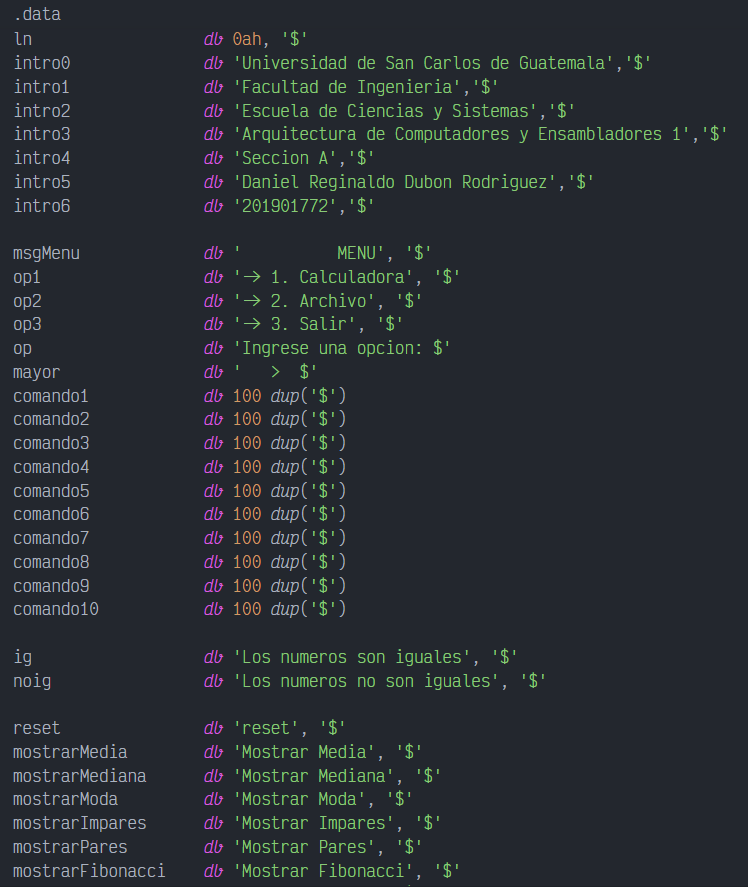 

En esta area se declaron las variables de tipo numerico que serviran para hacer operaciones aritmeticas.

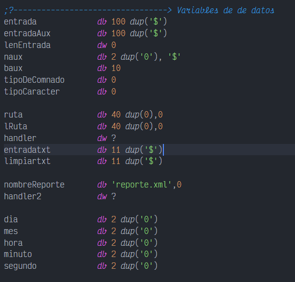 

En esta area se declararon las variables que serivran para escribir en el arhcivo de reporte

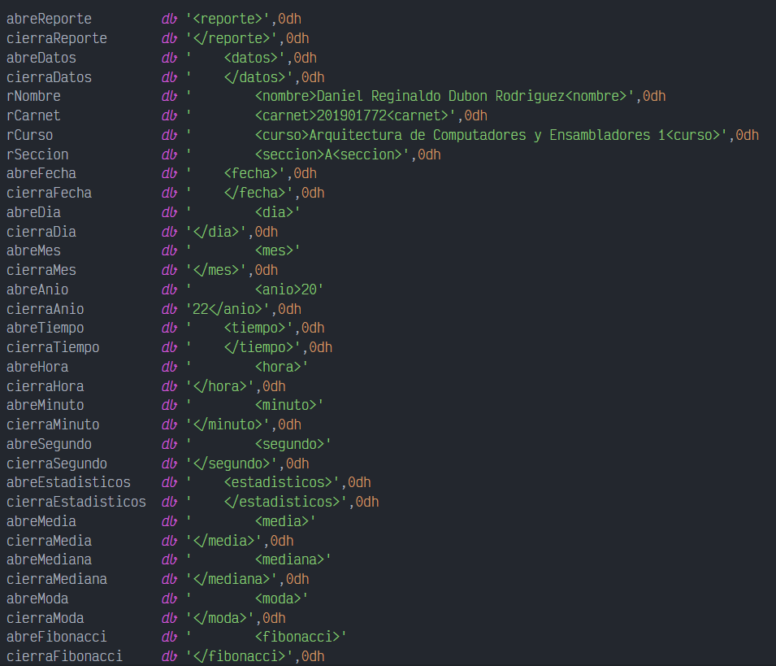 

### Menu

Se muestra la logica implementada para la creacion del menu principal, dependiendo de que tecla se presione, ejecutara alguna de las opciones seleccionadas

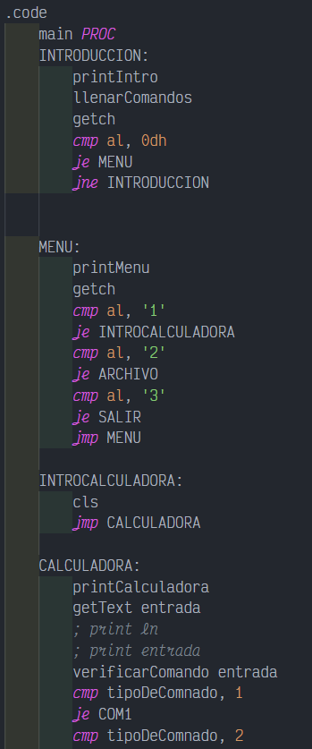 

En esta seccion nos permite detectar si algun comando fue ejecutado y en base al comando este realiza una accion

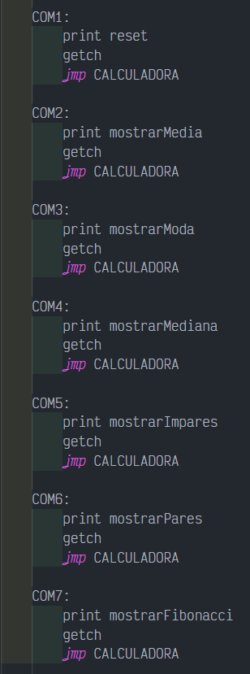 

En esta seccion permite el leer un archivo y tambien permite generar el reporte a la hora de salir

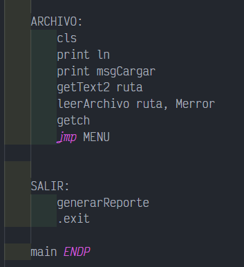 

## MACROS

### pritnc

Hace posible imprimir un texto en pantalla con un color especificado

 

### printn

Permite imprimir un numero de dos cifras en pantalla

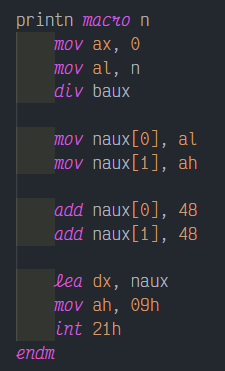 

### cls

Permite limpiar la pantalla

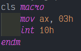 

### getch

Permite el ingreso de un caracter a traves del teclado

 

### getch2

Permite el ingreso de una ruta para abrir un archivo

 

### printMenu

Permite imprimpir el texto del menu en pantalla

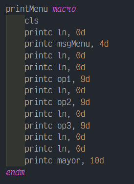 

### printCalc

Permite imprimir el formta de la calculadora

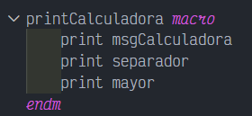 

### getText

Permite el ingreso de las expresiones aritmeticas en la calculadora

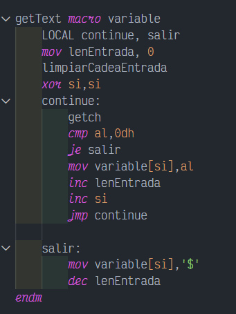 

### limpiarCadena

Permite limpiar la cadena donde se almacena la expresion aritmetica a operar

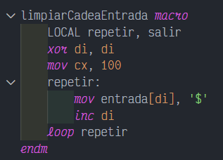 

### preProcesar

Esta procesa la cadena para poder traducir los operadores escritos en texto

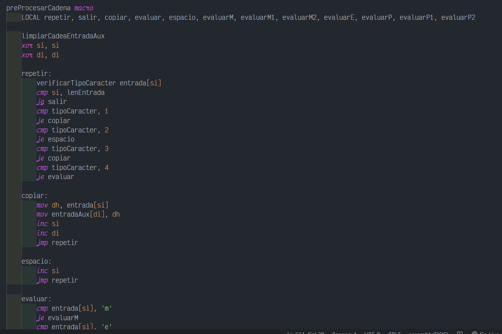 

### leerArchivo

Permite leer un archivo y guardar su contenido

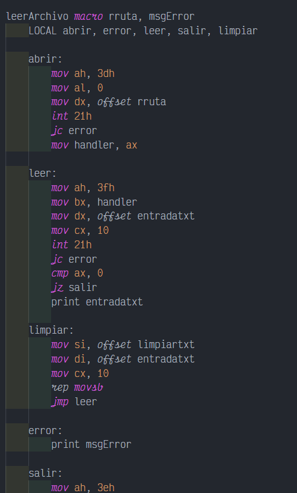 

### generarReporte

Permite generar el reporte del programa

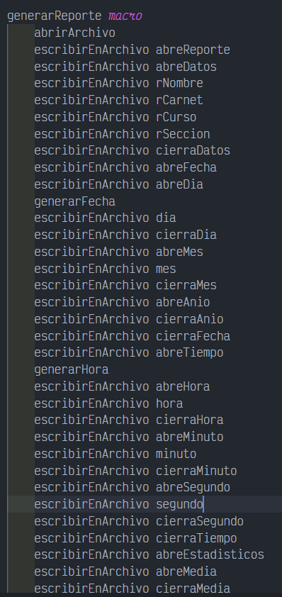 

### abrirArchivo

Permite abrir un archivo en modo lectura/escritura

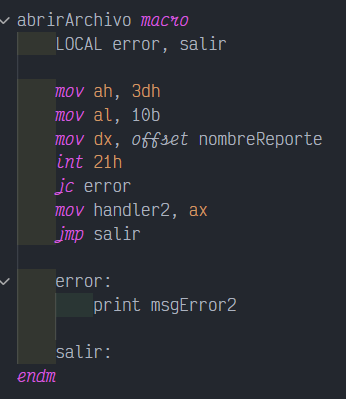 

### cerrarArchivo

Permite cerrar un archivo previamente abierto

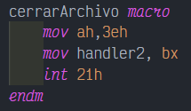 

### escribirArchivo

Permite escribir en un archivo

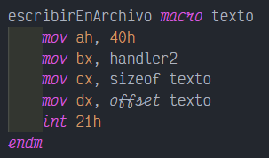 

### convertirCadena

Permite convertir un numero en cadena para poder imprimirlo en pantalla

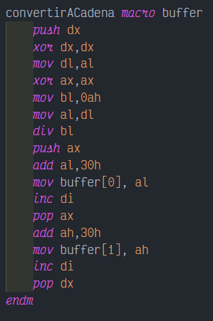 

### generarFecha

Genera la fecha y guarda el resultado en sus variables asignadas

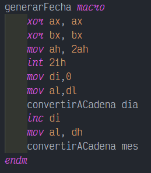 

### generarHora

Genera la hora actual que tiene el sistema y la guarda en sus variables asignadas

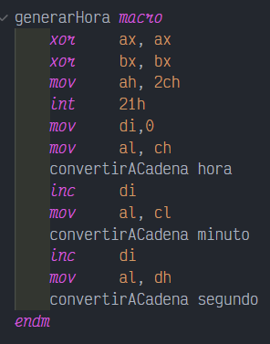 