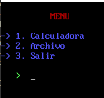
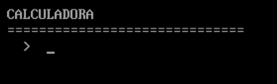
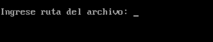
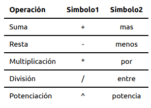
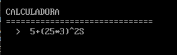
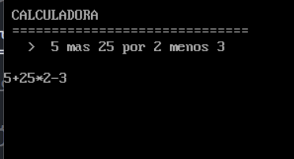
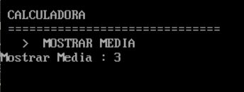
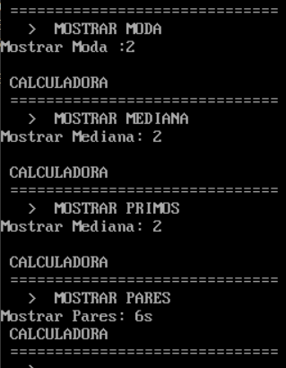
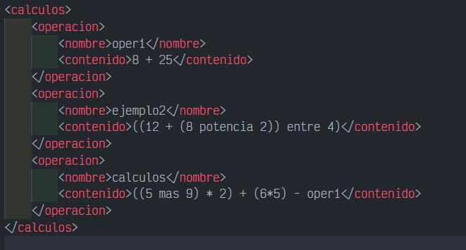
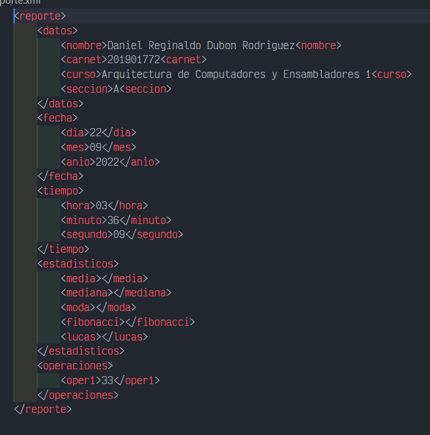

# Práctica 4 - Manual de Usuario

## Arquitecutra de Computadores y Ensambladores 1 Sección A
| Nombre                           | Carné                                      |
|:--------------------------------:|:------------------------------------------:|
| Daniel Reginaldo Dubón Rodríguez | 201901772                                  |

## INTRODUCCIÓN

Se realizó una calculadora basica en el lenguaje de programacion de bajo nivel Assembler, haciendo uso del emulador DosBox con el macro del lenguaje Assembler MASM v6.11               				

## Funciones de la Calculadora
- Realización de operaciones aritmeticas (suma, resta, multiplicacion, divisón)
- Calcular datos estadisticos (media, moda, mediana, cantidad de numeros pares, impares, numeros que pertenezcan a la serie fibonacci y lucas)
- Generacion de reportes
- Reconocimiento de comandos especiales
- Cargar archivo con operaciones aritmeticas en formtato XML
- Salir

## Mensaje Inicial

Cada vez que inicia el juego se muestra la informacion del desarrollador, solo se podra pasar de este mensaje tocando la tecla enter

 

### Menu Principal

Muestra las diferentes opciones del juego

 

- **Calculadora:** Mostrará en consola la opción de realizar operaciones matemáticas

 

- **Archivo:** Permitirá introducir la ruta del archivo de entrada en el que se almacenaron las operaciones a realizar.

 

- **Salir:** De no haber generado el reporte de ejecución (explicado más adelante) se generará en este momento y
terminará la ejecución del programa.

## Descripción :
Se desarrollo de una aplicación de consola, utilizando programación a bajo nivel (lenguaje
ensamblador), que tenga las funcionalidades de una calculadora que realice las siguientes operaciones:

- Suma
- Resta
- Multiplicación
- División
- Potenciación
  
Además de poder obtener los datos estadísticos de los números ingresados, por medio de archivo o
directamente; estos serán:

- Media
- Mediana
- Moda
- Cantidad de números pares
- Cantidad de números impares
- Cantidad de numeros tipo
  - Fibonacci
  - Lucas

## Simbolos que se pueden utilizar

Con estos simbolos se podran escribir espresiones artimeticas con las cuales podra hacer sus calculos, a continuacion se pude observar los dos tipos de simbolos que se pueden utilizar

 

### Ejemplo con simbolos 1

 

### Ejemplo con simbolos 2

 

**NOTA:** Se debe especificar la jerarquia de operaciones a traves del uso de paretenesis '(' ')'

## Comandos reconocidos
- **RESET :** 

  - Reiniciará todos los estadísticos tomados hasta el momento
  - Iniciará con una nueva operación
  - Si se ha cargado una operación desde archivo volverá a la posibilidad de usar la consola como calculadora o evaluar un nuevo ID

- **MOSTRAR MEDIA :** Mostrará la media de los números reconocidos al momento

- **MOSTRAR MODA :** Mostrará la moda de los números reconocidos al momento

- **MOSTRAR MEDIANA :** Mostrará la mediana de los números reconocidos al momento

- **MOSTRAR IMPARES :** Mostrará la cantidad de números impares reconocidos

- **MOSTRAR PARES :** Mostrará la cantidad de números pares reconocidos

- **MOSTRAR FIBONACCI :** Mostrará la cantidad de números Fibonacci reconocidos

- **MOSTRAR LUCAS :** Mostrará la cantidad de números Lucas reconocidos

- **EXEC[ID] :**

  - [ID] será reemplazado por el nombre de la operación cargada desde archivo
  - Se analizará la operación en cuestión y realizará todos los cálculos
  - Mostrará el resultado de la evaluación completa de la operación
  - quedará en espera de la instrucción MOSTRAR deseada
  - no podrá realizar cálculos matemáticos si se ha cargado un ID

- **SALIR :** Salir al menú principal

### Ejemplo

 

 

## Formato de archivo de entrada

 

## Formato de reporte generado

Cabe mencionar que este reporte se genera en la ubicacion local del programa y tendra el nombre de 'reporte.xml'

 